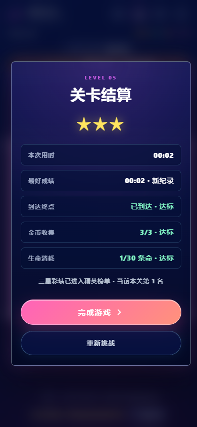

[English](README.md) | 简体中文

# Cube-Ball-Maze-Wangravity

结合倾斜操控、路线规划与重复挑战的网页钢球迷宫。作为个人小游戏项目，探索如何将物理交互做成完整、可验证的网页体验。

[](https://github.com/Sean-xzx/Cube-Ball-Maze-Wangravity/actions/workflows/ci.yml)

## 项目价值

无需安装原生应用，在浏览器体验六张手工设计的倾斜钢球迷宫，从基础移动逐步引入移动陷阱、金币和双向传送门。校准、提示、结算与最好成绩，让操控形成可反复挑战的体验；按键和触控提供不依赖手机传感器的操作方式。

## 我的贡献

- **玩法与产品决策**：主导关卡递进、金币与传送门规则、生命评级、水平校准和排行榜展示的需求迭代。
- **交互与功能整合**：将移动、转场、昵称/颜色头像、限时挑战和结算串成完整流程，保留本地最好成绩。
- **交付与验证**：推动仓库整理与可复现检查，覆盖地图、物理、存储和浏览器流程。实现与验证使用了代码辅助，不将第三方库视为个人原创。

## 技术方法

- **统一输入**：校准后的设备方向/运动、触控拖动与按键进入同一移动接口，将手机姿态映射为钢球微操。
- **物理与画面分离**：二维加速、摩擦和碰撞产生共享状态，由 Three.js 或 Canvas 绘制，无需重复实现玩法规则。
- **状态驱动反馈**：提示、游玩、失败、结算和榜单暂停协同管理计时与进度；金币、生命额度与最好用时提供寻路之外的挑战目标。

这些是工程设计亮点，不宣称原创物理算法或经过实验确认的研究创新。详见[架构与具体玩法规则](docs/ARCHITECTURE.md)。

## 成果证据

- **17 项自动测试通过**：覆盖地图约束、物理事件、隔离开发接口的存储/错误处理，以及仓库/文档一致性。
- **六关浏览器验收通过**：桌面 3D、移动视口 3D、移动 Canvas 三种模式，检查启动、输入、榜单暂停、非空画面与结算。
- 已验证 **Windows 与 Ubuntu 24.04**，Node.js 22.23.2 / npm 10.9.8。查看[已通过的远程 CI](https://github.com/Sean-xzx/Cube-Ball-Maze-Wangravity/actions/runs/37741557408)与[验证证据及边界](docs/VALIDATION.md)。



截图来自远程干净副本的真实 Chromium 运行。测试专用终点设置用于验收结算，画面用时**不是人工纪录**。未开展用户研究、性能基准或生产级云服务验证。[现有在线游戏](https://sean-xzx.github.io/wangravity/)为独立部署，不代表本仓库最新版本已上线。

## 运行

需要 Node.js 22.12+（`.nvmrc` 指定已验证的 22.23.2）、npm 和 Git。安装需要联网，本地游玩不需要付费服务。

```bash
git clone https://github.com/Sean-xzx/Cube-Ball-Maze-Wangravity.git
cd Cube-Ball-Maze-Wangravity
npm ci
npm run dev -- --host 127.0.0.1 --port 5173 --strictPort
```

打开 `http://127.0.0.1:5173/`：开始、选择昵称/头像、校准，再关闭提示。用方向键/WASD 或触控拖动移动；进入黑色终点后，应显示用时、最好成绩、金币、生命和评级。六关均可选择，榜单打开时暂停玩法/倒计时。加 `?quality=lite` 使用 Canvas，或加 `?quality=auto` 在小屏/触控设备自动选择轻量模式；普通地址使用 3D，初始化失败则回退。

手机倾斜需要传感器、HTTPS 和授权，局域网 HTTP 不满足要求。Android/iOS 真机传感器、震动、音频听感与持续运行性能**尚未验证**。不要将开发服务器暴露到互联网，也不要输入真实密码：昵称只是查询键，不是身份认证。

## 验证

```bash
npm test
npm run build
npx playwright install chromium
npm run test:browser
npm run preview -- --host 127.0.0.1 --port 4173 --strictPort
```

预期：测试和构建成功；浏览器验收输出 `PASS desktop-3d`、`PASS mobile-3d` 和 `PASS mobile-lite`。打开 `http://127.0.0.1:4173/` 查看构建结果。测试需要 4195/4196 端口空闲，软件 GPU 下完整检查可能需要数分钟。截图保存在已忽略的 `test-results/`，测试禁用外部写入。`npm run test:browser -- --lite` 可做较小检查，但不替代全部模式。

## 详细说明与限制

入口：`index.html` → `src/main.js` → `Game.js`；数据流：输入 → 物理 → 规则/界面 → 渲染。无需 `.env`。浏览器存储保存昵称、头像与最好成绩，不恢复进行中的局。Vite 本地 JSON 接口仅在开发时提供，预览/静态托管不包含接口。**带认证的全网账号、安全共享排名与防作弊尚未实现为生产服务。**

可选音乐/插图与真实玩家 JSON 不随本次公开版本分发；合成音效和核心玩法保留。详见[资源与恢复](docs/RESOURCES.md)、[架构](docs/ARCHITECTURE.md)、[验证](docs/VALIDATION.md)和[安全说明](SECURITY.md)。3D 构建有代码块大小警告，手机榜单滚动存在触控处理限制。个人原型项目不提供维护承诺，可通过 [Issues](https://github.com/Sean-xzx/Cube-Ball-Maze-Wangravity/issues)反馈可复现问题。

## 权利与致谢

Copyright © 2026 Sean-xzx。**当前版本中作者拥有的代码与文档保留所有权利，不授予开源许可。**使用、修改、再分发及商业使用须事先取得书面许可，法律或 GitHub 平台条款赋予的权利除外。公开可查看不代表一般使用/修改授权；GitHub 平台仍可能允许站内查看与 fork。

早期提交曾以 MIT 发布，本声明**不撤销**那些版本已经授予的许可。[Three.js](https://github.com/mrdoob/three.js)、[Vite](https://github.com/vitejs/vite) 与 [Playwright](https://github.com/microsoft/playwright)保留各自许可证。媒体分发权独立且尚未确认，详见[资源来源](docs/RESOURCES.md)。
